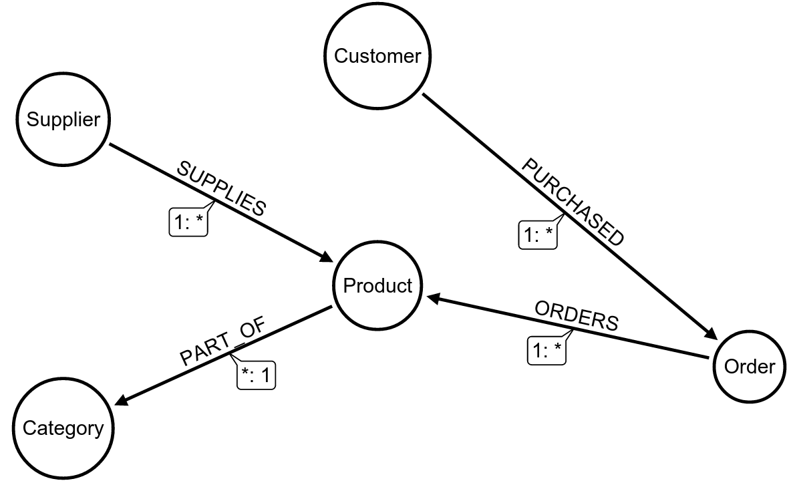

# Test project for the Northwind dataset with SDN4

## Data model

## Setup database

Setup a Neo4j server and load the complete Northwind dataset. Start with

    :play northwind graph

Then clone this repo.

## Configure access

Configure host and port in org.neo4j.example.northwind.AppContext

	public static final String NEO4J_HOST = "http://localhost:";
	public static final int    NEO4J_PORT = 7474;

If you're running against a 2.2 database, set username and password:

    public SessionFactory getSessionFactory() {
        System.setProperty("username", "neo4j");
        System.setProperty("password", "neo4j");
        [...]
    }

Build with

    mvn clean install

Run test app with

    mvn exec:java -Dexec.mainClass=org.neo4j.example.northwind.Run

## Results

The output are lists of the nodes and their related nodes of the Northwind graph:

### Products

    [...]
	Product Raclette Courdavault
	  Supplier: Gai pâturage
	  Category: Dairy Products
	Product Rhönbräu Klosterbier
	  Supplier: Plutzer Lebensmittelgroßmärkte AG
	  Category: Beverages
	Product Vegie-spread
	  Supplier: Pavlova
	  Category: Condiments
	Product Mishi Kobe Niku
	  Supplier: Tokyo Traders
	  Category: Meat/Poultry
	Product Gumbär Gummibärchen
	  Supplier: Heli Süßwaren GmbH & Co. KG
	  Category: Confections
	Product Queso Manchego La Pastora
	  Supplier: Cooperativa de Quesos 'Las Cabras'
	  Category: Dairy Products
	Product Outback Lager
	  Supplier: Pavlova
	  Category: Beverages
	Product Louisiana Hot Spiced Okra
	  Supplier: New Orleans Cajun Delights
	  Category: Condiments
    [...]
    
### Customers

    [...]
	Customer: Lino Rodriguez
	  Order: 10464
	  Order: 10551
	  Order: 10491
	  Order: 10604
	  Order: 10328
	  Order: 10664
	  Order: 10963
	  Order: 10352
	Customer: Yoshi Tannamuri
	  Order: 10620
	  Order: 10495
	  Order: 10810
	Customer: Patricio Simpson
	  Order: 10937
	  Order: 10521
	  Order: 11054
	  Order: 10881
	  Order: 10782
	  Order: 10819
	Customer: Ann Devon
	  Order: 10364
	  Order: 10532
	  Order: 11047
	  Order: 10726
	  Order: 11056
	  Order: 11024
	  Order: 10400
	  Order: 10987
	Customer: Manuel Pereira
	  Order: 10785
	  Order: 10268
    [...]
    
### Categories

    [...]
	Category: Seafood
	  Product: Rogede sild
	  Product: Röd Kaviar
	  Product: Jack's New England Clam Chowder
	  Product: Nord-Ost Matjeshering
	  Product: Konbu
	  Product: Ikura
	  Product: Gravad lax
	  Product: Spegesild
	  Product: Boston Crab Meat
	  Product: Escargots de Bourgogne
	  Product: Inlagd Sill
	  Product: Carnarvon Tigers
	Category: Beverages
	  Product: Lakkalikööri
	  Product: Côte de Blaye
	  Product: Laughing Lumberjack Lager
	  Product: Chartreuse verte
	  Product: Steeleye Stout
	  Product: Guaraná Fantástica
	  Product: Ipoh Coffee
	  Product: Sasquatch Ale
	  Product: Chai
	  Product: Outback Lager
	  Product: Chang
	  Product: Rhönbräu Klosterbier
	Category: Condiments
	  Product: Sirop d'érable
	  Product: Grandma's Boysenberry Spread
	  Product: Northwoods Cranberry Sauce
	  Product: Chef Anton's Gumbo Mix
	  Product: Gula Malacca
	  Product: Vegie-spread
	  Product: Original Frankfurter grüne Soße
	  Product: Louisiana Fiery Hot Pepper Sauce
	  Product: Chef Anton's Cajun Seasoning
	  Product: Genen Shouyu
	  Product: Louisiana Hot Spiced Okra
	  Product: Aniseed Syrup
    [...]

### Suppliers

    [...]
	Supplier: Pasta Buttini s.r.l.
	  Product: Gnocchi di nonna Alice
	  Product: Ravioli Angelo
	Supplier: Leka Trading
	  Product: Ipoh Coffee
	  Product: Singaporean Hokkien Fried Mee
	  Product: Gula Malacca
	Supplier: Heli Süßwaren GmbH & Co. KG
	  Product: NuNuCa Nuß-Nougat-Creme
	  Product: Gumbär Gummibärchen
	  Product: Schoggi Schokolade
	Supplier: New Orleans Cajun Delights
	  Product: Chef Anton's Gumbo Mix
	  Product: Chef Anton's Cajun Seasoning
	  Product: Louisiana Hot Spiced Okra
	  Product: Louisiana Fiery Hot Pepper Sauce
	Supplier: Norske Meierier
	  Product: Gudbrandsdalsost
	  Product: Geitost
	  Product: Flotemysost
	Supplier: Svensk Sjöföda AB
	  Product: Gravad lax
	  Product: Röd Kaviar
	  Product: Inlagd Sill
	Supplier: Zaanse Snoepfabriek
	  Product: Chocolade
	  Product: Zaanse koeken
	Supplier: PB Knäckebröd AB
	  Product: Gustaf's Knäckebröd
	  Product: Tunnbröd
    [...]

### Orders

    [...]
	Order: 10997
	  Customer: Carlos González
	  Product: Mascarpone Fabioli
	  Product: Spegesild
	  Product: Filo Mix
	Order: 10610
	  Customer: Annette Roulet
	  Product: Inlagd Sill
	Order: 10904
	  Customer: Karl Jablonski
	  Product: Tarte au sucre
	  Product: Escargots de Bourgogne
	Order: 10505
	  Customer: Jean Fresnière
	  Product: Tarte au sucre
	Order: 10405
	  Customer: Felipe Izquierdo
	  Product: Aniseed Syrup
	Order: 10327
	  Customer: Maria Larsson
	  Product: Chang
	  Product: Queso Cabrales
	  Product: Escargots de Bourgogne
	  Product: Nord-Ost Matjeshering
	Order: 10330
	  Customer: Carlos González
	  Product: Gumbär Gummibärchen
	  Product: Mozzarella di Giovanni
    [...]    
